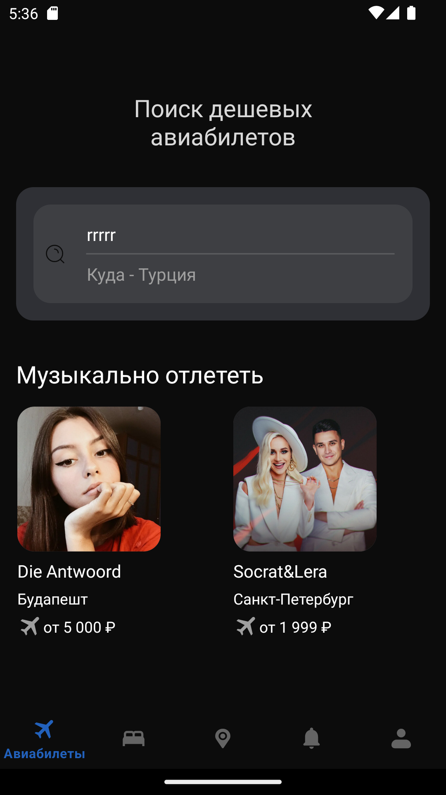
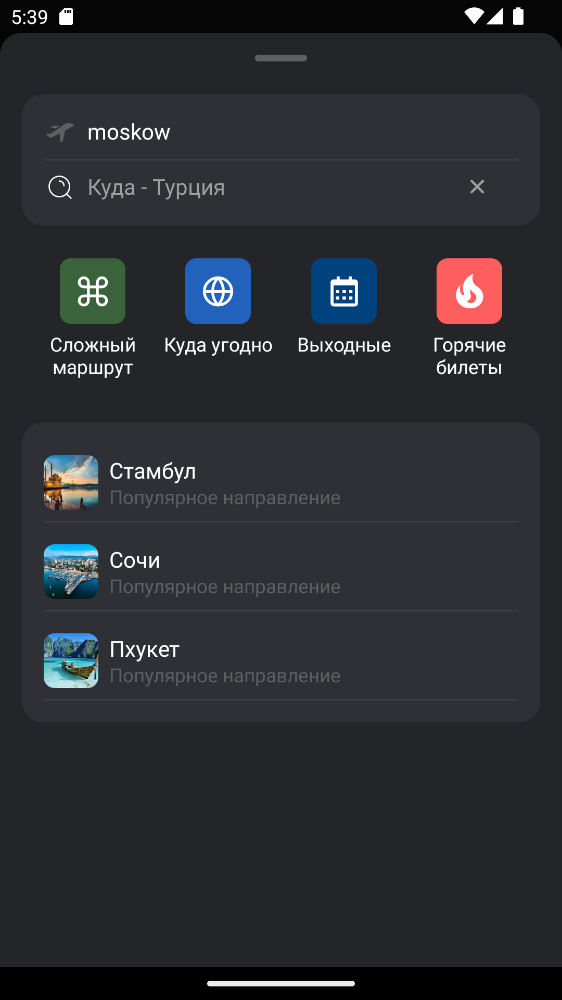
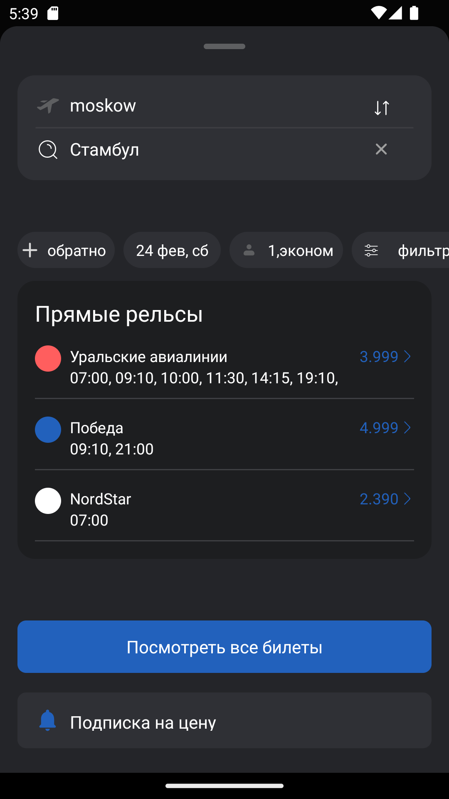
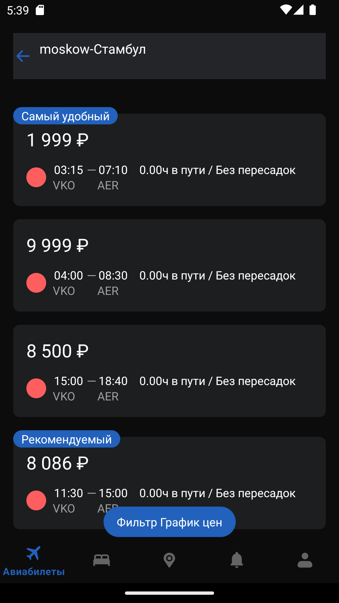

# TestTask_TicketsSearch

- ## Описание навигации между сверстанными экранами

на главном экране при нажатии на место прибытия (в верхней части экрана поле поиска с подсказкой "куда") 
открывается окно поиска.

в окне поиска при нажатии на рекомендуемое место прибытия (центральная часть экрана с тремя предложениями городов) 
окно частично меняется.
в измененном окне поиска при нажатии на просмотр билетов (синяя кнопка) открывается экран со списком билетов.

я позволил себе отойти от некоторых дизайнерских решений в верстке и коде, потому как это не производственный проект.
тем не менее технологический стек соответствует требуемому.

- ## Модульность

приложение разделено на пять основных гредл модулей:
- приложение
- домен
- дата
- презентер
- интерфейс (функционал, использование которого выходит за рамки одного модуля: например логгер)
- фичи (в данный момент отсутствуют - для будущего функционала)

домен и интерфейс не знает ни о ком, дата знает о домене и интерфейсе, презентер знает о домене и интерфейсе, 
приложение знает о всех.
добавлен модификатор "internal" к вьюмоделям и их стейтам, к списку (адаптеру и итему), 
к источникам данных и реализациям репозиториев, к основному аппликейшену.
новый функционал можно добавлять в новые фичерные модули.

- ## Чистая архитектура

приложение разделено на три основных слоя: 
- презентер, 
- домен 
- дата. 

дата отвечает за хранение данных и приход данных по сети, 
презентер отвечает за взаимодействие с пользователем, 
домен отвечает за передачу и обработку данных между другими слоями.

- ## Внедрение зависимостей

реализовано с помощью Dagger2,
многомодульность реализована с помощью сабмодулей (тем не менее есть решение лучше),
добавлено централизованное управление зависимостями

- ## Многопоточность

реализована с помощью Coroutines Flow, 
добавлена базовая обработка ошибок (исключения ловятся, ошибки пробрасываются далее), 
все выбросы логируются во вьюмоделях, 
исключения сети логируются в репозиториях перед забором данных из заглушечного источника
(заглушечный источник добавлен по причине не стабильной работы апи)

- ## Архитектурные паттерны

MVVM, вьюмодель общается с фрагментом с помощью лайвдаты

- ## Верстка

с помощью XML, произведена оптимизация лэйаутов по читаемости и производительности с помощью "include",
все иконки созданы с помощью векторной графики,
все ресуры вынесены в надлежащие файлы (кроме дименов)

- ## Сеть

реализована с помощью ретрофит (+ окшттп - для перехватов), добавлена (частично) null-обработка входящих данных,
если данные не пришли то берутся из заглушечного источника 
(заглушечный источник добавлен по причине не стабильной работы апи),
кеш не реализован.

- ## Список (экран список билетов)

произведены почти все оптимизации (верстка без вложенности, установка прослушивателей для примера, 
предварительная корректировка данных) 
кроме дифф утил (установлена без поддержки асинхронности) и переопределения базовых анимаций
